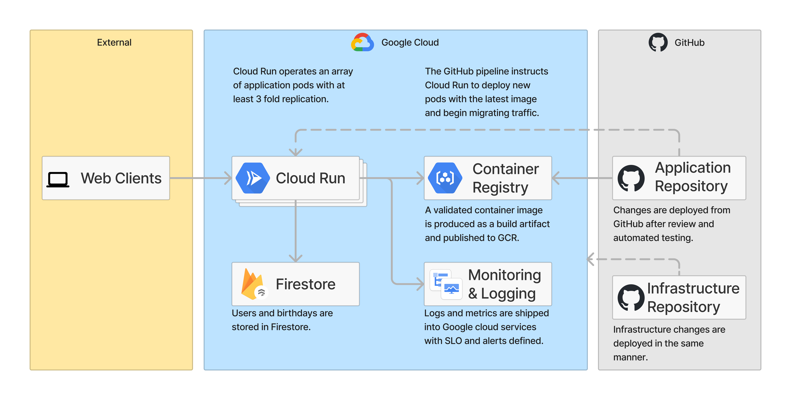

# Birthday Checker Infrastructure

This project houses the infrastructure powering the birthday-checker
application.

The application is deployed using a github actions pipeline.

Please submit a pull request to submit your contribution for review.



The following information describes how to use the code in the repository to
perform a manual deployment for informational purposes.

## Prerequisites

It is assumed you have a google cloud platform account with an active billing
account.

In order to run the initial setup script you'll need your billing account id.

Choose a project id to deploy to, if the project doesn't already exist,
it will be created.

## Environment

A dockerfile is available to provide a consistent environment with all required
dependencies included. Build and run it from the project root directory like so:

```bash
$ docker build . -t birthday-checker-infrastructure
$ docker run -it --rm \
  -e BILLING_ACCOUNT_ID=<your-billing-account-id> \
  -v $(pwd):/app
  birthday-checker-infrastructure
```

## Initial Setup

In order to deploy this infrastructure you'll first need to create a backend
bucket to store terraform state and a service account with permission deploy
the necessary resources.

The `./scripts/gcp-setup.sh` script can do this for you, run it like so:

```bash
$ gcloud auth login
$ source ./scripts/gcp-setup.sh <unique-scope-id>
```

Since google project names are globally scoped, we need to choose a unique id to
append. Replace `<unique-scope-id>` with a random string such as your
company name or the date. Use the same id each time you run the script unless
you wish to deploy a second instance.

The script is idempotent, so there is no harm running it multiple times if you
need to do any debugging.

Create and store the terraform service account credentials with the following
command:

```bash
$ gcloud iam service-accounts keys create deploy-key.json --iam-account="terraform@${TF_PROJECT_ID}.iam.gserviceaccount.com"
```

Note that the `gcp-setup.sh` script exports `$TF_PROJECT_ID`.

These are the credentials used by terraform to deploy resources in the next
step.

## Running

The setup script exports some terraform variables so you don't need to configure
them.
To deploy, run like so:

```bash
$ source ./scripts/gcp-setup.sh
$ export GOOGLE_APPLICATION_CREDENTIALS=<path-to-your-deployment-credentials-file>
$ cd ./terraform
$ terraform init -backend-config=bucket="${TF_PROJECT_ID}"
$ terraform apply
```

Review the generated changes and apply if acceptable.

## Benchmark

Running against 50 random names and dates `siege` produces the following results:

```
$ siege -c10 -t60s -f urls --content-type "application/json"
...
Transactions:                   4160 hits
Availability:                 100.00 %
Elapsed time:                  60.16 secs
Data transferred:               0.12 MB
Response time:                  0.14 secs
Transaction rate:              69.15 trans/sec
Throughput:                     0.00 MB/sec
Concurrency:                    9.95
Successful transactions:        4161
Failed transactions:               0
Longest transaction:            0.50
Shortest transaction:           0.12
```

I've discovered my router crashes if I use a concurrency of 20 😂.